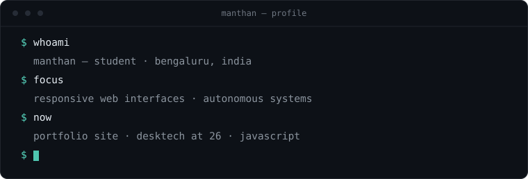

<!-- ───────────────────────────────────────────────────────────
     manthan · mntn26
     minimal profile readme — one typeface, one accent,
     a little bit of motion. hand-built, not templated.
     ─────────────────────────────────────────────────────────── -->

<picture>
  <source media="(prefers-color-scheme: dark)" srcset="assets/wordmark-dark.svg" />
  
</picture>

<h3><em>Independent Content Creator · Aspiring Web Developer · Robotics Enthusiast</em></h3>

  Building the future of tech education at
  <a href="https://youtube.com/@desktech26"><b>DeskTech at 26</b></a> and <b>Manthan Prototypes</b>.

  <code>· bengaluru, india</code>&nbsp;&nbsp;<code>· open to build</code>&nbsp;&nbsp;
  <a href="#-connect"><code>· say hello ↓</code></a>

  <a href="#about">about</a> ·
  <a href="#stack">stack</a> ·
  <a href="#currently-building">building</a> ·
  <a href="#-connect">connect</a>

### about

I am a student based in **Bengaluru, India**, dedicated to mastering the intersection of hardware and software. I spend my time coding responsive web interfaces and developing autonomous systems.

- 🔭 **Current Focus:** Developing a professional portfolio site to showcase my builds.
- 📺 **Content Creation:** Producing technical tutorials and guides on [DeskTech at 26](https://youtube.com/@desktech26).
- 🌱 **Learning Path:** Mastering HTML/CSS architecture and transitioning into advanced JavaScript.
- ⚡ **Fun Fact:** I enjoy building functional automation systems and exploring new UI/UX trends!

<code>a little more</code> — <em>quick facts</em>

 

| | |
|:---|:---|
| **id** | Manthan |
| **base** | Bengaluru, India |
| **role** | Content Creator · Web Developer · Robotics Enthusiast |
| **focus** | responsive web interfaces · autonomous systems |
| **channel** | [DeskTech at 26](https://youtube.com/@desktech26) |

 
<picture>
  <source media="(prefers-color-scheme: dark)" srcset="assets/terminal.svg" />
  
</picture>

### stack

| `software & web` | `systems & robotics` |
|:---|:---|
| &nbsp;&nbsp;&nbsp;&nbsp; |   `Micro-controllers` · `Hardware Logic` · `Circuit Design` · `Tinkercad` |

### currently building

- 📡 **Autonomous Systems:** Developing logic-based hardware projects using Arduino.
- 🌐 **YouTube Clone UI:** A fully responsive homepage layout built with pure CSS.
- 📝 **Personal Portfolio:** A custom branding site featuring professional CSS layouts and animations.

 

<code>activity</code> — <em>the snake never sleeps</em>

 

<picture>
  <source media="(prefers-color-scheme: dark)" srcset="https://raw.githubusercontent.com/Mnthn26/Mnthn26/output/github-snake-dark.svg" />
  <source media="(prefers-color-scheme: light)" srcset="https://raw.githubusercontent.com/Mnthn26/Mnthn26/output/github-snake.svg" />
  
</picture>

### connect

&nbsp;

  

