<!-- ═══════════════════════════════════════════════════════════════════════════════
  M N T N 2 6  ·  SYS.INTERFACE  —  custom-built neon HUD
  Every SVG in /assets is hand-engineered with native SMIL animation.
  No templates, no stock generators — pure terminal-grade signal.
═══════════════════════════════════════════════════════════════════════════════ -->

  

   
  ▲ uptime_counter — tracking every boot since day 001

 

  
<strong>Independent Content Creator | Aspiring Web Developer | Robotics Enthusiast</strong>

  
Building the future of tech education at <b>DeskTech at 26</b> and <b>Manthan Prototypes</b>.

<!-- ▸ QUICK NAV -->

  
  
  
  

## 🚀 About Me

I am a student based in **Bengaluru, India**, dedicated to mastering the intersection of hardware and software. I spend my time coding responsive web interfaces and developing autonomous systems.

- 🔭 **Current Focus:** Developing a professional portfolio site to showcase my builds.
- 📺 **Content Creation:** Producing technical tutorials and guides on [DeskTech at 26](https://youtube.com/@desktech26).
- 🌱 **Learning Path:** Mastering HTML/CSS architecture and transitioning into advanced JavaScript.
- ⚡ **Fun Fact:** I enjoy building functional automation systems and exploring new UI/UX trends!

<code>▸ cat system_specs.txt</code> — <em>quick facts, decrypted</em>

 

| key | value |
|:------|:-------------------------------------------------------|
| `id` | **MANTHAN** |
| `base` | Bengaluru, India |
| `role` | Content Creator × Web Developer × Robotics Enthusiast |
| `focus` | responsive web interfaces · autonomous systems |
| `uplink` | [DeskTech at 26](https://youtube.com/@desktech26) |

 

<table width="100%">
  <tr>
    <td width="50%"></td>
    <td width="50%"></td>
  </tr>
</table>

## 🛠️ Tech Stack & Tools

<table align="center">
  <tr>
    <td align="center" width="320" valign="top">
      <strong>▸ Software &amp; Web</strong>  
      
      
        
      
      
      
    </td>
    <td width="16"></td>
    <td align="center" width="320" valign="top">
      <strong>▸ Systems &amp; Robotics</strong>  
      
        
      <code>Micro-controllers</code> • <code>Hardware Logic</code> • <code>Circuit Design</code> • <code>Tinkercad</code>
    </td>
  </tr>
</table>

## 📊 Projects & Activity

 

- 📡 **Autonomous Systems:** Developing logic-based hardware projects using Arduino.
- 🌐 **YouTube Clone UI:** A fully responsive homepage layout built with pure CSS.
- 📝 **Personal Portfolio:** A custom branding site featuring professional CSS layouts and animations.

 

<code>▸ ./live_activity_feed</code> — <em>the snake never sleeps</em>

 

<picture>
  <source media="(prefers-color-scheme: dark)" srcset="https://raw.githubusercontent.com/Mnthn26/Mnthn26/output/github-snake-dark.svg">
  <source media="(prefers-color-scheme: light)" srcset="https://raw.githubusercontent.com/Mnthn26/Mnthn26/output/github-snake.svg">
  
</picture>

## 📫 Connect with Me

  

  
  

 

